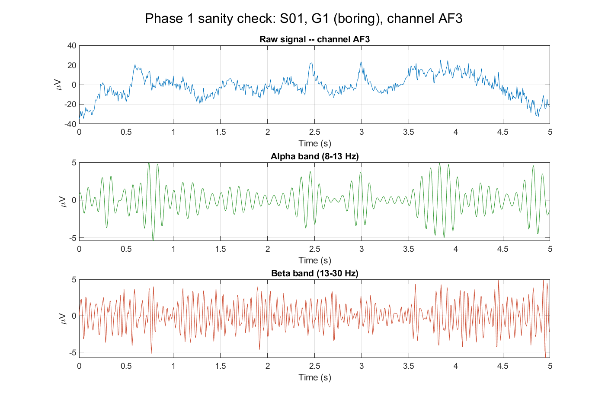
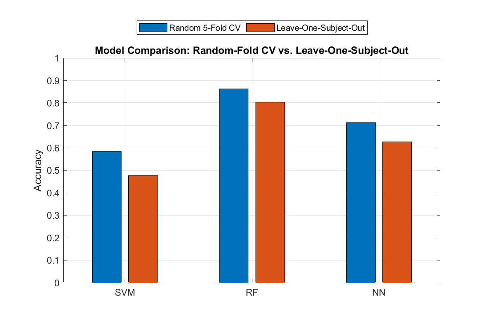
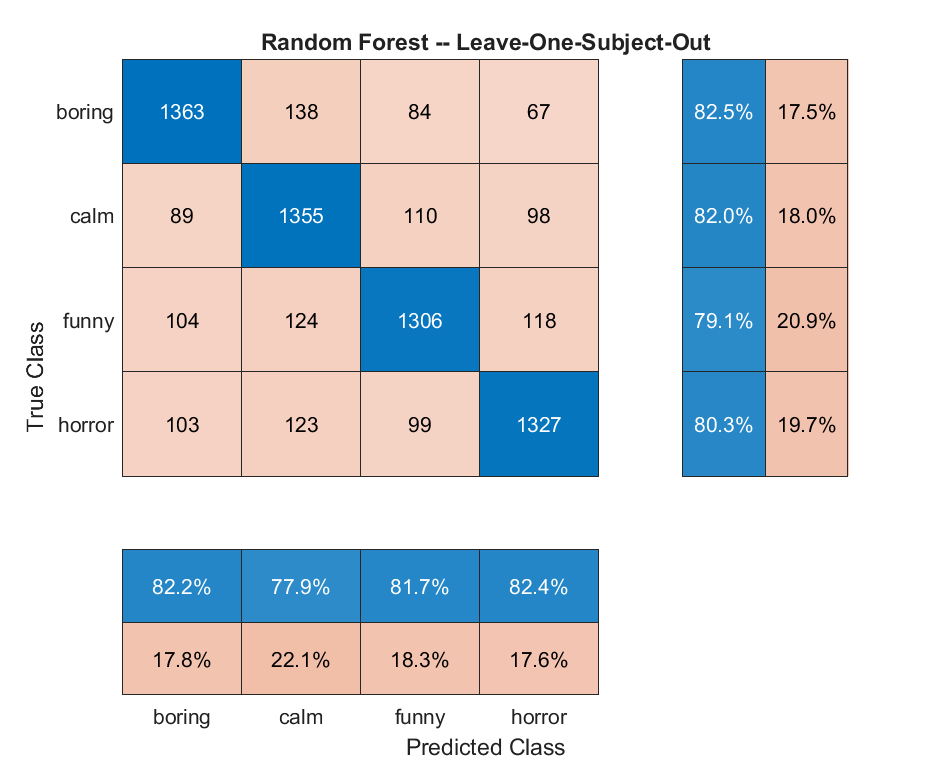
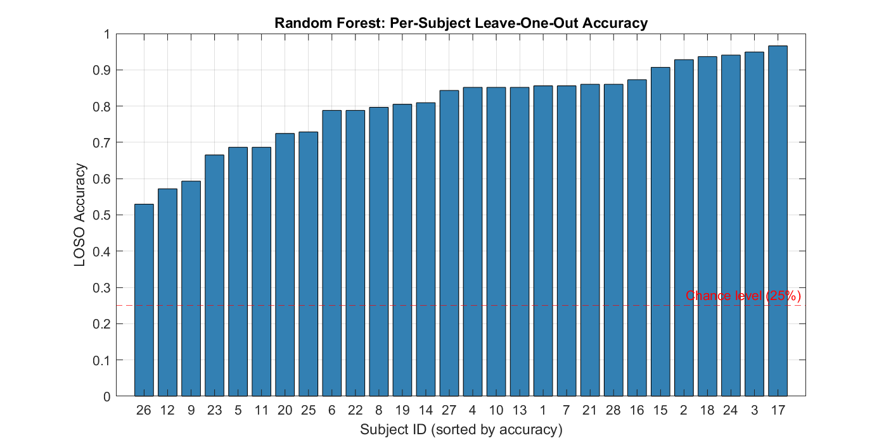
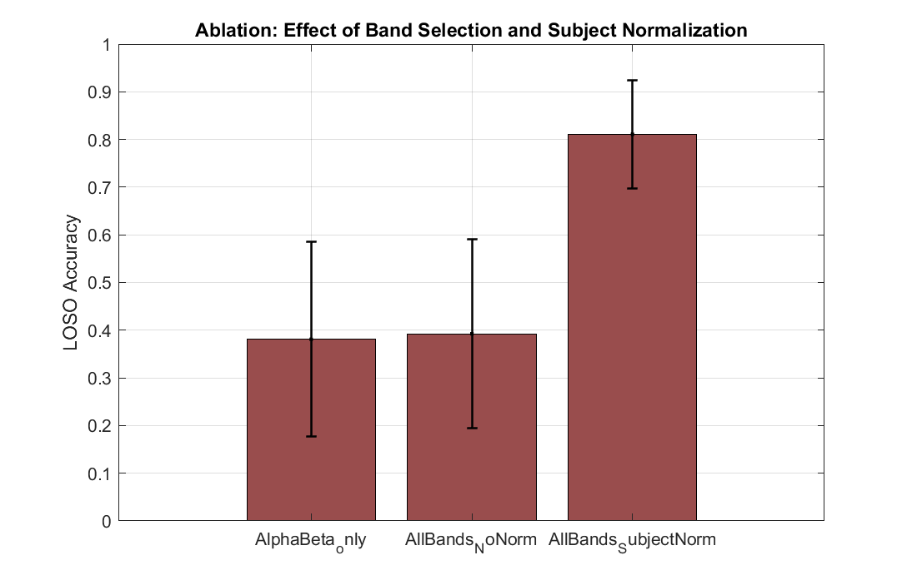
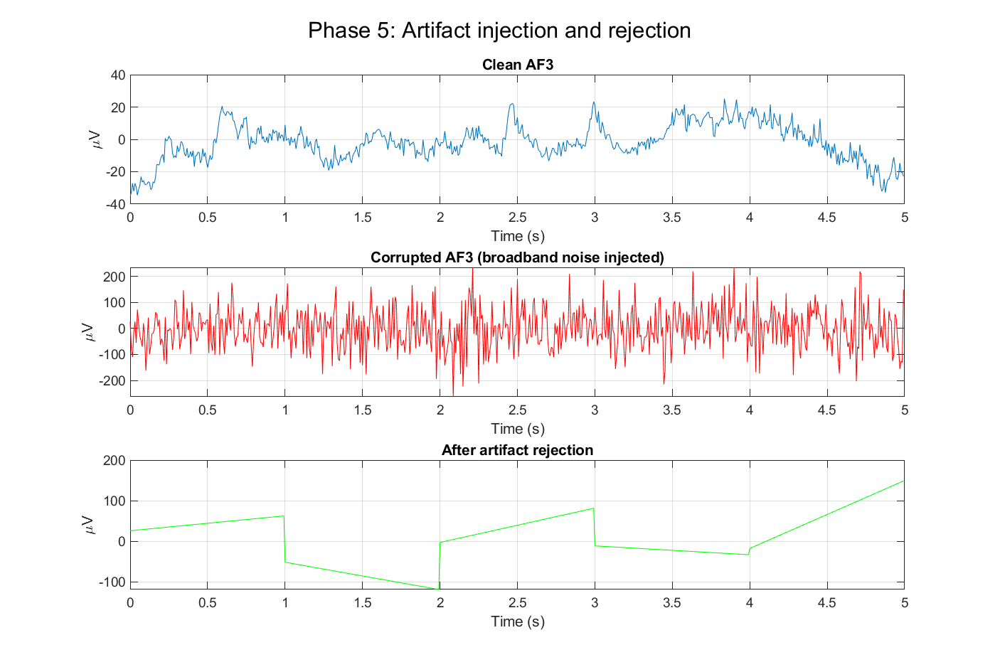

# EEG-Based Emotion Recognition (GAMEEMO Dataset)

Subject-independent emotion classification from raw EEG signals, using
band-power features and classical machine learning, validated with true
leave-one-subject-out cross-validation.

## Project Overview

- **Dataset:** GAMEEMO (Alakus et al., 2020) — 28 subjects, 14-channel
  Emotiv EPOC+ EEG, 4 emotion classes elicited via 4 different game genres
- **Data Scope:** Full raw EEG signal, 128 Hz, 5-minute recordings per
  subject per game (~2.2 hours of recording total)
- **Preprocessing:** Butterworth bandpass filtering (theta/alpha/beta/gamma),
  5-second non-overlapping windows, per-subject z-score normalization
- **Feature Extraction:** Band power across 14 channels x 4 frequency bands
  (56 features per window)
- **Objective:** Classify 4 emotional states (boring, calm, horror, funny —
  spanning the arousal/valence quadrants) in a way that generalizes to
  unseen subjects, not just unseen recordings

---

## Methodology

### 1. Data Audit
- Verified raw signal structure, channel names, sampling rate (~127.5 Hz
  measured vs. 128 Hz nominal), and label mapping before writing any pipeline
- Identified and corrected two source-data packaging inconsistencies
  (a nested duplicate subfolder, and one subject's files using a different
  naming convention)

### 2. Signal Processing
- 4th-order Butterworth bandpass filters (theta 4-8Hz, alpha 8-13Hz,
  beta 13-30Hz, gamma 30-45Hz), applied via zero-phase filtering (`filtfilt`)
- Validated on real signal before scaling to the full dataset

### 3. Feature Extraction
- 5-second non-overlapping windows (chosen specifically to avoid the
  near-duplicate/overlapping-window leakage documented below)
- Band power (mean squared amplitude) per channel per band
- Per-subject z-score normalization, to correct for inter-individual
  differences in absolute EEG amplitude unrelated to emotional state

### 4. Classification & Validation
- Three models compared: SVM (linear), Random Forest (bagged trees),
  small Neural Network
- **Two validation protocols compared directly**: naive random 5-fold CV
  vs. true leave-one-subject-out (28 folds) — see Key Findings below for
  why this comparison matters

### 5. Evaluation
- Confusion matrix, per-class precision/recall/F1
- Statistical significance testing (paired t-tests vs. chance and
  between models)

### 6. Robustness Testing
- Synthetic artifact injection (broadband noise across 4 of 14 channels)
  to test whether a simple amplitude/variance-based rejection method
  could recover a broken classification

---

## Key Findings

- **A dataset-selection finding, before any modeling began:** an initial
  candidate dataset (Bird et al. "Feeling Emotions") was diagnosed and
  rejected after discovering 95% of its rows shared their nearest
  neighbor's label — strong evidence of overlapping-window leakage from
  its pre-extraction process, on top of having only 2 subjects. See
  `data_audit.md` for the full investigation.
- **Random-fold CV meaningfully inflates accuracy relative to true
  leave-one-subject-out validation**, across every model tested (SVM:
  +10.7 points, Random Forest: +5.9 points, Neural Net: +8.3 points).
  Random Forest's smaller gap is itself informative — it's both the
  most accurate model AND the one whose naive-validation number was
  most trustworthy.
- **Per-subject normalization is the single most important design
  choice** — more than band selection. Without it, accuracy is barely
  above chance (39%); with it, accuracy triples (81%). See the ablation
  study below.
- **No dominant confusion axis** in the best model's errors — mistakes
  don't systematically cluster along either the arousal or valence
  dimension, suggesting the feature set captures genuine 4-way emotional
  structure rather than only one underlying dimension.
- **Per-subject accuracy varies widely (53%–97%)** — some individuals'
  EEG separates emotional states far more cleanly than others', a real
  pattern rather than noise (see per-subject chart below).
- **A single-channel-cluster artifact can break classification, and a
  simple rejection method can recover it** — demonstrated on a real
  example, with the honest caveat that this only works when *some*
  clean channels remain.

---

## Results

### Signal Processing Validation

Raw EEG filtered into alpha (8-13Hz) and beta (13-30Hz) bands for one
real channel/trial, confirming the filtering pipeline produces
physiologically plausible output before scaling to the full dataset.

---

### Model Comparison — Random-Fold vs. Leave-One-Subject-Out

| Model | Random 5-Fold CV | Leave-One-Subject-Out | Gap |
|---|---|---|---|
| SVM (linear) | 0.5834 ± 0.0122 | 0.4765 ± 0.0953 | 0.1068 |
| Random Forest | 0.8627 ± 0.0089 | **0.8037 ± 0.1166** | 0.0590 |
| Neural Network | 0.7110 ± 0.0101 | 0.6276 ± 0.1010 | 0.0834 |

Random Forest is both the best-performing model and the most robust to
the validation-leakage effect seen across all three.

---

### Confusion Matrix & Per-Subject Performance (Random Forest, LOSO)

**Per-class metrics:**

| Class | Precision | Recall | F1 |
|---|---|---|---|
| boring | 0.8216 | 0.8251 | 0.8233 |
| calm | 0.7787 | 0.8202 | 0.7989 |
| funny | 0.8168 | 0.7906 | 0.8034 |
| horror | 0.8242 | 0.8033 | 0.8136 |

Macro-average F1: **0.8098**

**Statistical significance:**

| Test | t-statistic | df | p-value |
|---|---|---|---|
| RF vs. chance (25%) | 25.12 | 27 | 2.93 × 10⁻²⁰ |
| RF vs. SVM (paired) | 14.55 | 27 | 2.68 × 10⁻¹⁴ |

Accuracy ranges from 31% (subject 26) to 96.6% (subject 17) — well
above chance for the great majority of subjects, but with meaningful
individual variation worth investigating further (see Future Work).

---

### Ablation Study — What Actually Mattered

| Feature Set | Mean LOSO Accuracy | Std | # Features |
|---|---|---|---|
| Alpha + Beta only | 0.3809 | 0.2044 | 28 |
| All 4 bands, no normalization | 0.3926 | 0.1982 | 56 |
| All 4 bands + per-subject normalization | **0.8108** | 0.1132 | 56 |

Per-subject normalization accounts for the overwhelming majority of
model performance — a ~42-point jump — while adding theta/gamma bands
alone contributed roughly 1 point.

---

### Artifact Robustness

| Condition | Prediction | Correct? |
|---|---|---|
| Clean window | boring | ✓ |
| Corrupted (broadband noise, 4/14 channels) | calm | ✗ |
| Corrupted + artifact rejection applied | boring | ✓ |

A basic amplitude/variance-threshold rejection method, applied per
1-second sub-window, recovered the correct classification after a
realistic multi-channel artifact broke it.

---

### Computational Cost

| Stage | Time |
|---|---|
| Model training (6,372 rows, 56 features) | 6.3 sec |
| Feature extraction per 5-sec window (56 features) | 314 ms |
| Classification per window | 126 ms |
| **End-to-end per window** | **441 ms (~11x faster than real-time)** |

Measured on desktop hardware (MATLAB R2024b); not tested on embedded
hardware. See `results/tables/runtime_measurements.csv`.

---

## Literature Comparison

| Study | Method | Validation | 4-Class Accuracy |
|---|---|---|---|
| Genetically-optimized PDPL (2023) | Dictionary pair learning + GA | Subject-independent | 49.0% |
| CLBP + CSA + XGBoost (2025) | Chaotic local binary pattern + gradient boosting | "Subject-independent" | 99.2%* |
| **This work** | Band power + per-subject normalization + Random Forest | **True LOSO (28 folds)** | **81.1%** |

*The 99.2% figure warrants caution — this project's own findings (see
Key Findings above) show naive validation protocols can substantially
inflate reported accuracy on windowed EEG features; the full methodology
of that result was not available to confirm whether similar leakage was
controlled for. See `results/tables/literature_comparison.md` for the
full note.

---

## Conclusion

This project demonstrates that 4-class emotion recognition from raw EEG
is achievable with a classical, computationally lightweight pipeline
(band-power features + Random Forest) at 81.1% accuracy under genuinely
subject-independent validation. The work's central methodological
contribution is diagnostic rather than architectural: identifying and
quantifying two ways EEG-emotion pipelines commonly overstate performance
— overlapping-window leakage and naive random-fold cross-validation — and
showing that per-subject normalization, not model complexity or band
selection, is what actually closes the resulting gap.

## Future Work

- Test on additional datasets (e.g. DEAP, SEED) pending institutional
  data-access approval, to assess whether the normalization finding
  generalizes across recording setups
- Investigate why per-subject accuracy varies so widely (31%-97%) —
  possible links to self-reported SAM arousal/valence ratings included
  in the source dataset
- Test the artifact-rejection method under a wider range of corruption
  severities and channel-coverage levels
- Deploy the pipeline on actual embedded/edge hardware to validate the
  real-time-capability claim beyond desktop measurement

---

## Notes on Dataset Availability

The GAMEEMO dataset is not included in this repository. It is freely
available (no license request required) from Mendeley Data:
https://data.mendeley.com/datasets/b3pn4kwpmn/3

## Requirements

- MATLAB R2024b (or compatible)
- Signal Processing Toolbox
- Statistics and Machine Learning Toolbox

## Project Structure (this public repository)

public/
├── README.md
├── data_audit.md # investigation of the initially-used,
│ # later-rejected Bird et al. dataset
├── data_audit_gameemo.md # audit of the GAMEEMO dataset actually used
└── results/
├── figures/ # all result visualizations
└── tables/ # all result tables (CSV + literature comparison)

Full source code (MATLAB scripts and functions) is maintained in a
private companion repository.